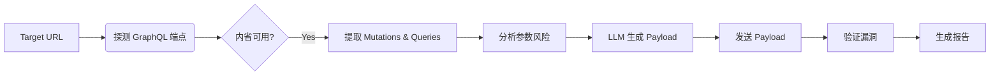

# mcp-GraphQL

> **Model-assisted Cyber Penetration for GraphQL**
> 一个轻量级、AI 驱动的 GraphQL 自动化漏洞探测工具。利用大语言模型（LLM）智能分析 Schema，自动构造并验证 SSRF、RCE、信息泄露等漏洞。


## 🔍 功能特性

- ✅ 自动 GraphQL 指纹识别（支持多种常见路径）
- ✅ 内省（Introspection）泄露检测与 Schema 获取
- ✅ Mutation & Query 参数自动提取与风险分析
- ✅ **AI 驱动**：大模型生成 SSRF/RCE/SQLi/信息泄露 Payload
- ✅ 自动漏洞验证（OAST + 时间盲注 + 关键词匹配）
- ✅ 清晰的控制台彩色输出与报告生成
- ✅ 支持多种 LLM（Qwen、Ollama/Llama3）

## 🚀 快速开始

### 1. 环境要求

- Python 3.8+
- pip 包管理器

### 2. 安装依赖

```bash
git clone https://github.com/yourusername/GraphQL-MCP.git
cd GraphQL-MCP
pip install -r requirements.txt
```

### 3. 配置 LLM API

#### 方式一：使用阿里云 Qwen（推荐）

1. 访问 [阿里云 DashScope](https://dashscope.aliyun.com) 获取免费 API Key
2. 设置环境变量：

```bash
# Windows
set DASHSCOPE_API_KEY=your_api_key_here

# Linux/macOS
export DASHSCOPE_API_KEY=your_api_key_here
```

或直接在命令行使用 `--api-key` 参数。

#### 方式二：使用本地 Ollama（离线）

```bash
# 安装 Ollama
# https://ollama.ai

# 启动 Ollama 服务
ollama serve

# 下载 Llama3 模型
ollama pull llama3
```

### 4. 运行扫描

```bash
# 使用 Qwen（默认）
python mcp-graphql.py --url https://target.com --oast-domain yourid.oastify.com

# 使用本地 Llama3
python mcp-graphql.py --url https://target.com --model llama3

# 跳过 LLM，仅做基础扫描
python mcp-graphql.py --url https://target.com --skip-llm

# 保存报告
python mcp-graphql.py --url https://target.com --output report.json
```

### 5. 查看结果

- 控制台会实时显示扫描进度和发现的漏洞
- 对于 SSRF 漏洞，需要手动检查 OAST 平台（如 [Interact.sh](https://interact.sh) 或 [Burp Collaborator](https://portswigger.net/burp/documentation/collaborator)）是否有回连

## ⚙️ 参数说明

| 参数              | 说明                                       | 默认值                  |
| ----------------- | ------------------------------------------ | ----------------------- |
| `--url`           | 目标基础 URL（必填）                       | -                       |
| `--oast-domain`   | OAST 域名（用于 SSRF 检测）                | example.oastify.com     |
| `--model`         | LLM 模型：`qwen` 或 `llama3`/其他 Ollama   | qwen                    |
| `--api-key`       | Qwen API Key（也可用环境变量）             | -                       |
| `--timeout`       | 请求超时时间（秒）                         | 10                      |
| `--output`, `-o`  | 输出报告文件（.json 或 .md）               | -                       |
| `--skip-llm`      | 跳过 LLM 分析，仅做基础扫描                | false                   |

## 🧠 工作原理



### 扫描流程

1. **指纹识别**：自动探测 `/graphql`、`/api/graphql` 等常见路径
2. **Schema 获取**：发送 Introspection Query 获取完整 Schema
3. **参数分析**：提取 Mutation/Query 参数，基于命名推断风险类型
4. **AI 分析**：将 Schema 信息传给 LLM，生成针对性 Payload
5. **漏洞验证**：
   - **SSRF**：使用 OAST 域名，检查是否回连
   - **RCE**：测量响应时间（`sleep 5` > 4s 判定为阳性）
   - **SQLi**：检查响应中是否包含 SQL 错误信息
   - **信息泄露**：匹配响应中的敏感关键词（password、token 等）
6. **报告生成**：输出彩色控制台报告，可选保存为 JSON/Markdown

## 📊 示例输出

```
  ███╗   ███╗ ██████╗██████╗        ██████╗ ██████╗  █████╗ ██████╗ ██╗  ██╗ ██████╗ ██╗
  ████╗ ████║██╔════╝██╔══██╗      ██╔════╝ ██╔══██╗██╔══██╗██╔══██╗██║  ██║██╔═══██╗██║
  ██╔████╔██║██║     ██████╔╝█████╗██║  ███╗██████╔╝███████║██████╔╝███████║██║   ██║██║
  ██║╚██╔╝██║██║     ██╔═══╝ ╚════╝██║   ██║██╔══██╗██╔══██║██╔═══╝ ██╔══██║██║▄▄ ██║██║
  ██║ ╚═╝ ██║╚██████╗██║           ╚██████╔╝██║  ██║██║  ██║██║     ██║  ██║╚██████╔╝███████╗
  ╚═╝     ╚═╝ ╚═════╝╚═╝            ╚═════╝ ╚═╝  ╚═╝╚═╝  ╚═╝╚═╝     ╚═╝  ╚═╝ ╚══▀▀═╝ ╚══════╝

  Model-assisted Cyber Penetration for GraphQL
  AI 驱动的 GraphQL 自动化漏洞探测工具
  [!] 仅用于授权渗透测试

[*] 正在探测 GraphQL 端点: https://target.com
[+] 发现 GraphQL 端点: https://target.com/graphql
[*] 正在获取 GraphQL Schema (Introspection)...
[+] 成功获取 Schema
[*] 发现 5 个 Mutations
[*] 发现 12 个 Queries

============================================================
Schema 分析结果
============================================================

Mutations:
  - importPaste [风险: ssrf, path_traversal]
      host: String (ssrf)
      port: Int
      path: String (ssrf, path_traversal)
  - executeCommand [风险: rce]
      cmd: String (rce)

[*] 正在调用 Qwen API 生成 Payload...
[+] LLM Payload 生成成功

============================================================
漏洞验证
============================================================

[*] 测试 Payload #1 [SSRF]
  mutation { importPaste(host: "abc.oastify.com", port: 80, path: "/") { result } }
[!] SSRF Payload 已发送，请检查 OAST 平台

[*] 测试 Payload #2 [RCE]
  mutation { executeCommand(cmd: "sleep 5") { output } }
[VULN] RCE: 响应时间 5.12s，可能存在命令注入!

============================================================
漏洞扫描报告
============================================================

发现 1 个潜在漏洞:

[漏洞 #1]
  类型: RCE
  详情: 响应时间 5.12s，可能存在命令注入
  Payload: mutation { executeCommand(cmd: "sleep 5") { output } }

[提醒] 请检查 OAST 平台 (abc.oastify.com) 确认 SSRF 漏洞
```

## 🎯 测试目标

以下是一些公开的 GraphQL 测试环境：

- [DVGA (Damn Vulnerable GraphQL Application)](https://github.com/dolevf/Damn-Vulnerable-GraphQL-Application)
- [GraphQL Voyager Demo](https://apis.guru/graphql-voyager/)
- 你自己搭建的测试环境

**注意**：请勿对未授权目标使用本工具！

## 🛠 高级用法

### 自定义 OAST 平台

```bash
# 使用 Interact.sh
curl https://interact.sh/register  # 获取你的域名
python mcp-graphql.py --url https://target.com --oast-domain xxxxx.oastify.com

# 使用 Burp Collaborator
python mcp-graphql.py --url https://target.com --oast-domain xxxxx.burpcollaborator.net
```

### 批量扫描

```bash
#!/bin/bash
for url in $(cat targets.txt); do
  python mcp-graphql.py --url $url --output reports/${url//\//_}.json
done
```

## 🔧 故障排除

### 1. `ModuleNotFoundError: No module named 'dashscope'`

```bash
pip install dashscope
```

### 2. Ollama 连接失败

确保 Ollama 服务正在运行：

```bash
ollama serve
```

### 3. OAST 验证问题

- 确保使用你自己的 OAST 域名（不要使用默认的 `example.oastify.com`）
- 检查目标是否有出站网络限制
- 等待 30-60 秒后再检查 OAST 平台

### 4. 内省被禁用

如果目标禁用了 Introspection，工具将无法获取 Schema。你可以：
- 尝试手动分析前端 GraphQL 请求
- 使用 `--skip-llm` 模式进行基础测试

## 🤝 贡献

欢迎提交 Issue 和 Pull Request！

## 📜 许可证

MIT License - 详见 [LICENSE](LICENSE) 文件

## 🛡 免责声明

**本工具仅用于授权渗透测试和安全研究。请勿对未授权目标使用。**

- 使用者需自行承担法律责任
- 作者不对任何滥用行为负责
- 请遵守当地法律法规和道德规范

## 🙏 致谢

- 灵感来源于 GraphQL 安全社区的研究成果
- 感谢 [DVGA](https://github.com/dolevf/Damn-Vulnerable-GraphQL-Application) 提供的测试靶场
- 感谢阿里云 DashScope 和 Ollama 提供的 LLM 支持

---

**⭐ 如果这个项目对你有帮助，请给个 Star！**
